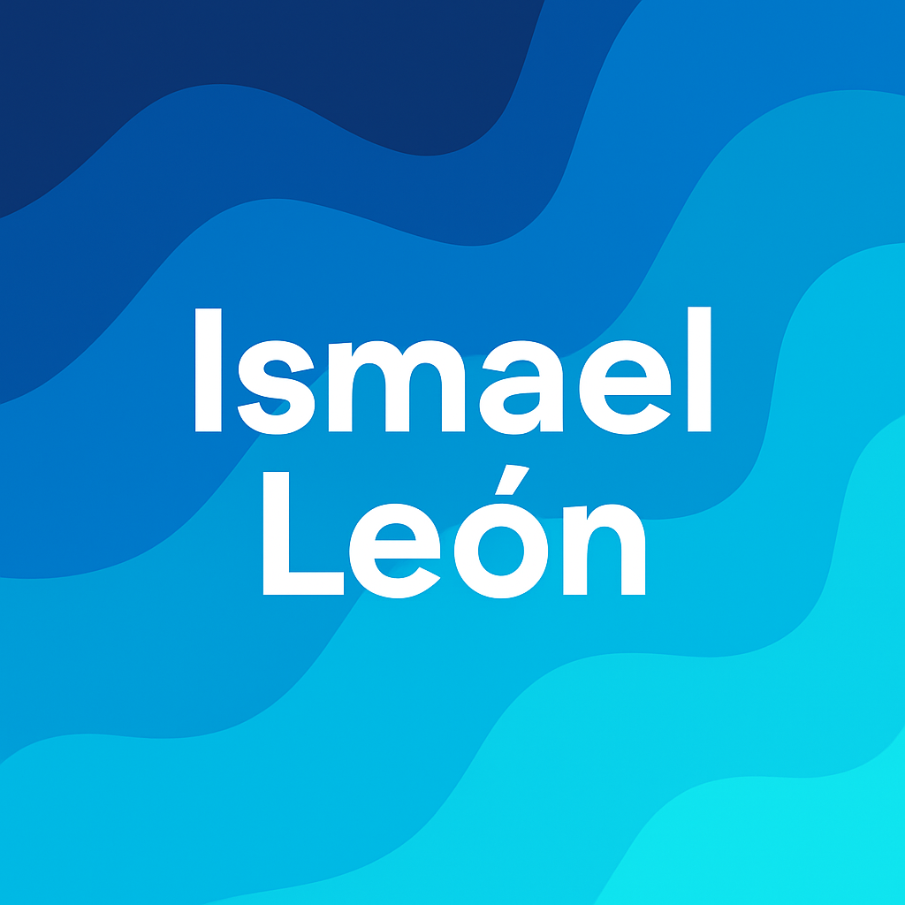

<table style="width: 100%; border: none; text-align: center;">
  <tr>
    <td colspan="2" style="text-align: center;">
      <h1>💻About Me</h1>
    </td>
  </tr>
  <tr>
    <td style="width: 40%; text-align: center;">
      
    </td>
    <td style="width: 60%; padding-left: 20px;">
      

        I am a Computer Engineer student passionate about the IT world. I love helping and solving problems through meaningful tech solutions. I'm always open to exciting projects, especially those related to technology and software development. Right now, I'm focused on deepening my knowledge in some frameworks and expanding my skills in cloud-based architectures.
      

      

        Beyond tech, I enjoy gaming 🎮, staying active at the gym 🏋️‍♂️, and exploring computer hardware 🧠💻. These interests keep me inspired, curious, and always eager to learn new things in both life and tech.
      

    </td>
  </tr>
</table>

## 💻 Tech Stack

## 🧑‍💻 Languages

## 🗄️ Databases

## ☁️ Cloud

---

##

| 
<h1>🌐 Socials</h1>  
 |   |
| :--------- | :--------- |

