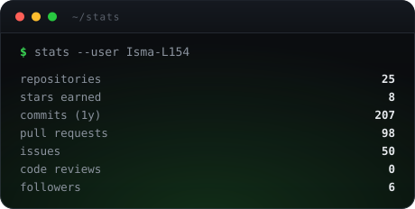
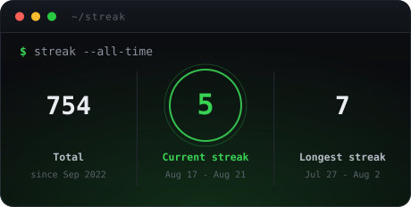
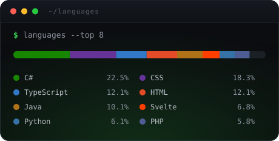
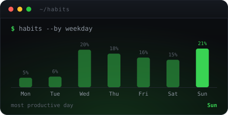
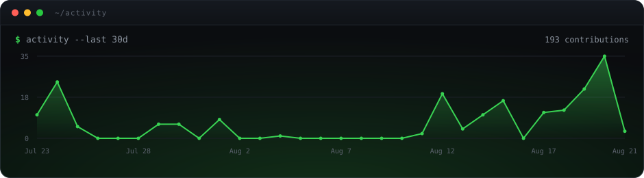

 

---

## 💻 About Me

<table>
  <tr>
    <td width="42%" align="center">
      
    </td>
    <td width="58%">
      

        <b>DevOps Engineer</b> passionate about <b>automation</b>, <b>cloud technologies</b>,
        and building systems that are reliable, scalable, and easy to maintain.
      

      

        I enjoy solving complex problems, improving development workflows, and designing
        infrastructure that helps teams move faster and more confidently. My interests include
        cloud-native technologies, Infrastructure as Code, CI/CD, containers, Kubernetes,
        observability, and software development.
      

      

        I'm always learning, experimenting with new tools, and looking for opportunities to grow
        as an engineer while contributing to impactful projects.
      

    </td>
  </tr>
</table>

---

## 🛠️ Tech Stack

  

&nbsp;&nbsp;

&nbsp;&nbsp;

&nbsp;&nbsp;

  

  

&nbsp;&nbsp;

&nbsp;&nbsp;

  

  

&nbsp;&nbsp;

&nbsp;&nbsp;

&nbsp;&nbsp;

&nbsp;&nbsp;

  

  

&nbsp;&nbsp;

&nbsp;&nbsp;

&nbsp;&nbsp;

---

## 📊 GitHub Stats

<!-- Cards below are generated daily by .github/workflows/update-stats.yml (see scripts/generate-stats.mjs)
     and served straight from this repo, so they are never rate limited. -->

---

  

⚡ <i>Automate everything that can be automated.</i>

