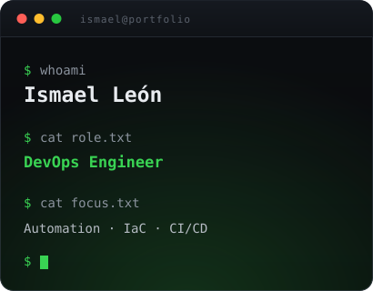

 

  

---

## 💻 About Me

<table>
  <tr>
    <td width="42%" align="center">
      
    </td>
    <td width="58%">
      

        <b>Computer Engineer</b> passionate about <b>automation</b>, <b>cloud technologies</b>,
        and building systems that are reliable, scalable, and easy to maintain.
      

      

        I enjoy solving complex problems, improving development workflows, and designing
        infrastructure that helps teams move faster and more confidently. My interests include
        cloud-native technologies, Infrastructure as Code, CI/CD, containers, Kubernetes,
        observability, and software development.
      

      

        I'm always learning, experimenting with new tools, and looking for opportunities to grow
        as an engineer while contributing to impactful projects.
      

      

        📍 San José, Costa Rica &nbsp;·&nbsp; 🌱 Currently deepening my DevOps &amp; Cloud skills
      

    </td>
  </tr>
</table>

---

## 🛠️ Tech Stack

<b>🧑‍💻 Languages</b>
  

&nbsp;&nbsp;

&nbsp;&nbsp;

&nbsp;&nbsp;

  

<b>☁️ Cloud</b>
  

&nbsp;&nbsp;

&nbsp;&nbsp;

  

<b>⚙️ DevOps &amp; Tools</b>
  

&nbsp;&nbsp;

&nbsp;&nbsp;

&nbsp;&nbsp;

  

<b>🗄️ Databases</b>
  

&nbsp;&nbsp;

&nbsp;&nbsp;

&nbsp;&nbsp;

---

## 🚀 Featured Project

### 🖥️ Terminal Portfolio

An interactive portfolio built as a real terminal — animated boot sequence, 
ASCII banner, ghost autocomplete and swappable color themes. Type `help` and explore.

 

  

---

## 📊 GitHub Stats

 

 

  

  

---

## 🌐 Connect With Me

  

  

⚡ <i>Automate everything that can be automated.</i>

